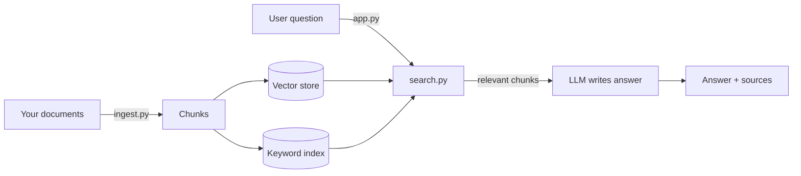

# 🧠 Build Your Own RAG Chatbot

A beginner-friendly template for building a chatbot that answers questions about **your own documents** — any subject, any collection of files. It uses **RAG** (Retrieval-Augmented Generation): instead of hoping a language model already knows the answer, you *show* it the relevant pages and ask it to answer from them. That's what keeps answers grounded and lets the bot cite its sources.

The same engine in this repo powers two very different reference bots:

- **Juris** — a legal-research assistant over statutes and rules.
- **LSLA Asks** — an employee-benefits assistant over HR/benefits documents.

Different subjects, identical pipeline. That's the point: swap the documents and it's *your* chatbot.

---

## How RAG works (in one minute)



Two phases:

1. **Prepare (once):** cut your documents into small **chunks** and build two search indexes — one for *meaning* (vector) and one for *exact words* (keyword).
2. **Chat (every question):** **retrieve** the most relevant chunks, **paste** them into a prompt, and let the **LLM** write the answer from them.

---

## The four files you'll actually read

The top level is deliberately tiny — four short, heavily-commented files that map one-to-one to the steps below. Read them in this order:

| File | What it does |
|------|--------------|
| **`config.py`** | All your settings and the two AI clients (embeddings + chat), in one place. |
| **`ingest.py`** | STEP 1 — turns documents into the vector store + keyword index. |
| **`search.py`** | STEP 2 — finds the chunks most relevant to a question (vector / keyword / hybrid). |
| **`app.py`** | STEP 3 — the chat UI that retrieves, builds a prompt, and shows the answer. |

Everything advanced (the full production app with four retrieval strategies, structure-aware retrieval, cost tracking, Airtable logging, and the PDF-parsing notebook) lives in **[`advanced/`](./advanced)** — see [`advanced/ADVANCED_GUIDE.md`](./advanced/ADVANCED_GUIDE.md) once the basics click.

---

## Step-by-step

### Step 0 — Install

```bash
git clone <your-repo-url>
cd rag-chatbot-template

python -m venv .venv
source .venv/bin/activate          # Windows: .venv\Scripts\activate

pip install -r requirements.txt
```

### Step 1 — Add your API keys

This template uses **Azure OpenAI** by default (a chat model + an embedding model). Copy the template and fill in your values:

```bash
cp .env.example .env
```

```dotenv
AZURE_OPENAI_API_KEY=your-key
AZURE_OPENAI_ENDPOINT=https://your-resource.openai.azure.com/
AZURE_CHAT_DEPLOYMENT=your-chat-deployment-name
AZURE_EMBEDDING_DEPLOYMENT=your-embedding-deployment-name
```

`.env` is git-ignored, so your keys never reach GitHub. Using plain OpenAI or another provider instead? It's a two-line change — see the note at the bottom of `config.py`.

### Step 2 — Add your documents

Drop `.txt` or `.pdf` files into the **`data/`** folder. A sample handbook is already there so you can try it immediately; delete it once you add your own.

### Step 3 — Build the indexes

```bash
python ingest.py
```

This runs four sub-steps (all printed as it goes), defined in `ingest.py`:

1. **Load** every file in `data/` into memory.
2. **Split** each document into ~1,000-character chunks (with a little overlap so sentences aren't cut in half).
3. **Build the vector store** — embed every chunk and save it to `storage/vectors/`. *(This step calls the embedding API.)*
4. **Build the keyword index** — a BM25 index saved to `storage/keyword_index.pkl`. *(No API needed.)*

You only rerun this when your documents change.

### Step 4 — Chat

```bash
streamlit run app.py
```

Ask a question. For each one the app retrieves the relevant chunks, sends them to the LLM, shows the answer, and lists the **sources** in an expander so you can verify it.

---

## How each part works (and why)

### `config.py` — settings + clients
RAG needs two AI models: an **embedding model** (turns text into vectors that capture meaning) and a **chat model / LLM** (writes the answer). Creating them in one place means one spot to change provider or fix a key. Secrets are read from `.env`, never written in code.

### `ingest.py` — preparing the documents
LLMs and search both work best on small, focused pieces of text, so we **chunk** each document. Then we build **two** indexes because they fail in opposite ways:

- **Vector (semantic) search** finds chunks by *meaning* — it'll match "cancel my plan" to a paragraph titled "termination of coverage". But it can miss exact terms.
- **Keyword (BM25) search** nails exact words, names, and numbers — but is blind to paraphrasing.

Building both lets them cover each other's weaknesses.

### `search.py` — retrieval
Three functions, increasing in power:

- `vector_search()` — meaning-based (needs the embedding API).
- `keyword_search()` — exact-word based (no API; great for a quick offline test).
- `hybrid_search()` — runs both and **interleaves** the results (1st vector, 1st keyword, 2nd vector…), removing duplicates. We rank by *position* rather than raw score because a vector "distance" and a BM25 "score" aren't on the same scale. When both methods return the same chunk, that's a strong signal it's relevant.

> Try it without spending anything: `python search.py "how many vacation days?"` runs the keyword half only, no API key required.

### `app.py` — the chatbot
The RAG loop in three lines (`answer_question`): **retrieve** chunks → **augment** the prompt by pasting them in → **generate** the answer. The prompt tells the model to answer *only* from the provided context and to admit when it doesn't know — that's what prevents confident wrong answers. The Streamlit UI then shows the answer plus its sources.

---

## Customizing it

| Want to… | Change this |
|----------|-------------|
| Use plain OpenAI / a different provider | the two functions in `config.py` (commented example included) |
| Get more or fewer source chunks per answer | `TOP_K` in `config.py` |
| Change chunk size / overlap | `CHUNK_SIZE`, `CHUNK_OVERLAP` in `config.py` |
| Change the bot's tone or rules | `PROMPT_TEMPLATE` in `app.py` |
| Point at a different documents folder | `DOCS_FOLDER` in `config.py` |

---

## When you're ready for more

The basics above are a complete, working chatbot. The **[`advanced/`](./advanced)** folder is the production version behind Juris and LSLA Asks, and adds:

- **Four selectable retrieval strategies** (vector-only → hybrid → structure-aware → LLM-reranked).
- **Structure-aware retrieval** — expands a matched chunk back to its full section using document hierarchy (chapters, sections, clauses).
- **Cost tracking** per question (`cost_tracker.py`) and optional **Airtable logging**.
- A **PDF-parsing notebook** that detects headings by font to build rich metadata.

Read **[`advanced/ADVANCED_GUIDE.md`](./advanced/ADVANCED_GUIDE.md)** for the full walkthrough.

---

## Repository structure

```
rag-chatbot-template/
├── README.md              # this guide
├── requirements.txt
├── .env.example           # copy to .env and fill in your keys
├── .gitignore
│
├── config.py              # settings + AI clients          (read 1st)
├── ingest.py              # STEP 1: documents -> indexes    (read 2nd)
├── search.py              # STEP 2: retrieval               (read 3rd)
├── app.py                 # STEP 3: the chat UI             (read 4th)
│
├── data/
│   └── sample_handbook.txt   # demo doc — replace with your own
│
└── advanced/              # the full production version (Juris / LSLA Asks)
    ├── ADVANCED_GUIDE.md
    ├── app.py             # four-strategy app
    ├── build_bm25.py
    ├── legal_bm25_search.py
    ├── metadata_fields.py
    ├── cost_tracker.py
    └── notebooks/build_database.ipynb
```

`storage/` (the built indexes) and `.env` are created locally and git-ignored.

---

## Security notes

- No API keys live in this repo — they're read from `.env`, which is git-ignored. Before your first push, run `git status` and confirm `.env` isn't listed.
- A `.pkl` index executes code when loaded; only load index files **you built yourself**.
- Check your documents' licenses before publishing them in a public repo.
