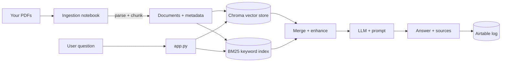

# 🧠 Build Your Own RAG Chatbot

A complete, working template for building a **Retrieval-Augmented Generation (RAG)** chatbot over **your own collection of documents** — with hybrid search, structure-aware retrieval, per-question cost tracking, and a feedback loop.

This repo ships as a reference implementation (a legal-research assistant over Texas statutes) but every piece is designed to be swapped out for **your** documents, **your** metadata, and **your** LLM provider.

> **TL;DR** — Point the ingestion notebook at your PDFs, edit one metadata file to describe how your documents are structured, drop your API keys into a `.env`, and run `streamlit run app.py`.

---

## What you get

- **A Streamlit chat UI** with document selection, multi-document search, source display, and 👍/👎 feedback.
- **Four retrieval strategies** you can compare side by side (explained below).
- **Hybrid search** — semantic (vector) search *and* BM25 keyword search, run concurrently and merged.
- **Structure-aware retrieval** — retrieved chunks are expanded back to their full section using document hierarchy metadata, so the model sees complete context instead of fragments.
- **Cost tracking** — every question is priced (input tokens, output tokens, embeddings) with `tiktoken`.
- **Optional logging** — each interaction + feedback can be written to Airtable for analytics.

---

## How it works



There are **two stages**:

1. **Ingestion (offline, run once per document)** — `notebooks/build_database.ipynb`
   Extracts text from a PDF, detects its hierarchical structure (e.g. Title → Chapter → Section), attaches that structure as metadata, splits the text into semantic chunks, and builds two indexes: a **Chroma vector store** and a **BM25 keyword index**.

2. **Serving (online)** — `app.py`
   A Streamlit app that loads those indexes, retrieves relevant chunks for a question, feeds them to the LLM with a strict prompt, and shows the answer with its sources.

---

## The four retrieval modes

The reference app implements four strategies (nicknamed after the Ninja Turtles in the code). They are a useful menu of RAG techniques — start simple, add complexity only if your answers need it.

| Mode | Strategy | When to use it |
|------|----------|----------------|
| **Michelangelo** | Pure vector search. Embed the question, pull the nearest chunks, answer. | Simplest baseline. Good for clean, well-chunked text. |
| **Raphael** | Hybrid: vector **+** BM25 keyword search, results interleaved. | When exact terms/numbers matter (names, section numbers, defined terms). |
| **Leonardo** | Hybrid **+ hierarchy expansion**: each hit is expanded to its full parent section via metadata. | When chunks are too small and the model needs the whole section for context. *(This is the app's default.)* |
| **Donatello** | Leonardo **+ an extra LLM re-ranking pass** that scores each chunk 0–100 and drops irrelevant ones. | When retrieval is noisy and you want the model to filter before answering (costs one extra LLM call). |

Each adds one idea on top of the last. The bottom of [`GUIDE.md`](./GUIDE.md) walks through the code for each.

---

## Quickstart

```bash
# 1. Clone and enter
git clone <your-repo-url>
cd rag-chatbot-template

# 2. Create a virtual environment
python -m venv .venv
source .venv/bin/activate        # Windows: .venv\Scripts\activate

# 3. Install dependencies
pip install -r requirements.txt

# 4. Add your secrets
cp .env.example .env
#    then edit .env with your real keys

# 5. Build indexes from your PDFs (run the notebook)
jupyter notebook notebooks/build_database.ipynb

# 6. Launch the chatbot
streamlit run app.py
```

> **Don't have Azure OpenAI?** This template uses Azure, but LangChain makes swapping providers a two-line change. See [*"Using a different LLM provider"*](./GUIDE.md#using-a-different-llm-provider) in the guide.

---

## Repository structure

```
rag-chatbot-template/
├── README.md                     # you are here
├── GUIDE.md                      # full step-by-step build-your-own walkthrough
├── requirements.txt
├── .env.example                  # copy to .env and fill in
├── .gitignore                    # keeps secrets + large indexes out of git
│
├── app.py                        # the Streamlit chat application
├── metadata_fields.py            # describes how YOUR documents are structured
├── build_bm25.py                 # builds the BM25 keyword index (run after ingestion)
├── legal_bm25_search.py          # loads + queries the BM25 keyword index
├── cost_tracker.py               # token counting + cost calculation
│
└── notebooks/
    └── build_database.ipynb      # ingestion: PDF -> chunks -> vector + BM25 indexes
```

At runtime the app also expects two folders that the notebook generates (they are git-ignored, since they're large and rebuildable):

```
embeddings/<Document Name>.pdf/   # Chroma vector store, one per document
bm25/<Document_Name>_bm25.pkl     # BM25 keyword index, one per document
```

---

## Adapting this to your own documents

The three things you will actually edit:

1. **`metadata_fields.py`** — describe your documents' structure (e.g. a contract has `parties → clause → subclause`; a textbook has `chapter → section`). This drives both retrieval filtering and the structure-aware expansion.
2. **The ingestion notebook** — adjust the parsing logic to detect *your* documents' headings. The reference parser keys off PDF fonts (bold = heading); yours may key off numbering, regex, or Markdown headers.
3. **The prompt** in `app.py` (`PROMPT_TEMPLATE`) — rewrite it for your domain. The reference one is tuned for cautious legal answers ("use only the provided sources").

The full walkthrough is in **[GUIDE.md](./GUIDE.md)**.

---

## Security notes

- **No keys live in this repo.** All credentials are read from environment variables / `.env`, which is git-ignored. Before you ever push, run `git status` and confirm `.env` is **not** staged.
- If you deploy on Streamlit Community Cloud, use **`st.secrets`** instead of `.env` (same variable names). The guide shows how.
- Source PDFs and built indexes are git-ignored by default — check your documents' licenses before publishing them.

---

## License

Add a license of your choice (MIT is a common default for templates). The reference documents (Texas statutes) are public records; **your** documents may not be — verify before distributing.
